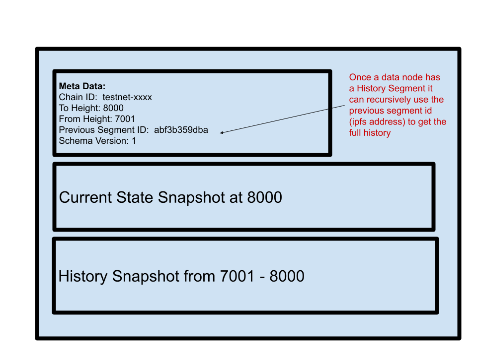

# Decentralized History

[TOC]

## Why we have it

Gigabytes of event data per day are produced by the Vega core and stored in the Datanode.  It is not feasible for a new Datanode joining the network to replay all blocks from the first block in order to recreate the history and get itself into a state to be able to consume new blocks - such as ensuring it has all parties and markets - it would take far too long.  Decentralized History allows the data-node to reach out to peer nodes to fetch the most recent history,  as well as older history if desired, such that it can quickly get itself up to the latest block height of the network and start to consume events for the latest block from the Vega core.  Decentralization is at the heart of the Vega platform, and thus the mechanism to store and retrieve Datanode history must itself be decentralized - hence Decentralized History.

## How to use it

By default, a new data node will connect to the network of its peers, retrieve the latest segment of history, and load this into the Datanode such that it is in a state to consume new blocks immediately, this is controlled by the configuration parameter `AutoInitialiseFromDeHistory` .   By default Datanode is setup to fetch just the latest History Segment, if more history is required that can specified when starting the Datanode for the first time using the `--dehistory.initialise.block-count` flag, for example to start your new node and have it fetch and load the last days data, assuming a time between blocks of 1s, you would do this:

`data-node node --dehistory.initialise.block-count=86400`

However, depending on how much history you like to load, fetching it all at startup may not be the best approach as the networks block height may have moved on so much during the time taken to fetch the history that it would then take too long for the Datanode to catchup to the latest height.  For this reason, it is possible to download the history asynchronously whilst the data node is running and consuming the latest blocks.   The method for doing this is as follows.

### Getting History Asynchronously

After starting the data-node, run:

`data-node dehistory show`

This will display the History Segments stored in the node, e.g:

`from_height:2001 to_height:3000 chain_id:"test-chain-clbOFm" history_segment_id:"QmUggHRGorV264FxsbnQUGQpGCTdjd5xytFXUyEnQN1dy1" previous_history_segment_id:"QmaBRouyXMtprM3RyYy6Gbr4QcMmf8j5hnMu3T87wsapyY"`

Select the id of the oldest segment (lowest `from_height`) and then run:

`data-node fetch QmUggHRGorV264FxsbnQUGQpGCTdjd5xytFXUyEnQN1dy1 1000`

Replacing 1000 in the above example with however many blocks of history you would like to fetch and the segment id with the id of the oldest segment in your node.  Once this completes, stop the data-node and run:

`data-node dehistory load`

That's it, your Datanode will now contain all the fetched history.  Note, there are plans to make this process automated in a future release of Datanode.

## How it works

OK, so we've looked at why we have Decentralized History and how to use it.  Now we delve into the details of how it works under the covers, if you plan only to use Datanode and not actively develop it then you need not read this section. 

Each Datanode produces History Segments as it processes events, we will delve into what a History Segment is further on in more detail, for now just know that its the collection of data between 2 block heights.   The number of blocks in a segment is controlled by the network parameter `snapshot.interval.length` and will produce History Segments at the same block height intervals as snapshots are produced by the core node.  

The sharing of History Segments between nodes is done using the Inter Planetary File System (https://ipfs.tech/).   Critical to the functioning of Decentralized History is that the History Segments produced on every node for a given block span are **identical** such that the IPFS Content IDs of the segment are the same across all nodes, this in turn means that there is no need to upload data between nodes as each node will produce and therefore be able to act as a source of History Segments.  Thus when a new node joins the network and requests a History Segment for a given ID  (IPFS content ID) the provision of data to the node is shared across all other nodes in the network.

Once the node has fetched and loaded the segment it will process new blocks and in turn generate and store History Segments in the Decentralized History.  

#### IPFS Swarms and retrieving the latest History Segment

All Datanodes for a given network (chain) will be part of the same IPFS Swarm, the IPFS Swarm key is generated using the nodes chain id.   Using a swarm key improves the quality of communication between nodes and, in addition, using a swarm key makes it easy to get the network address of peers in the swarm.   Using this feature, Decentralized History can reach out to peers and request the latest History Segment id.  Once the id of the History Segment is retrieved all history prior to that segment can be retrieved as each segment contains the previous segments id as shown in the next section.  There is also a command to get the networks latest History Segment: `data-node dehistory latest-history-segment-from-peers`.  Let's take a look at what a History Segment is.

### Anatomy of a History Segment

There are 3 files contained within a History Segment as show above, we discuss each in turn below:

##### Meta Data

In addition to the Previous Segment ID mentioned in the previous section, meta data also includes a `Schema Version`.  The schema version is used when loading a segment to ensure that the segment is applied against the correct version of the data schema, the loading process will update the schema automatically as the History Segments are applied.     

##### Current State Snapshot and History Snapshot

Tables in Datanode are split into two types, History Tables (which are timescale hypertables https://www.timescale.com/) and Current Tables.  For example, positions data has both a `positions_current` and `positions` table. `positions_current` holds the latest position for each party/market pair and `positions` holda the history of how the positions have changed over time.  When Datanode takes a snapshot it splits this data into a Current State Snapshot and History Snapshot respectively. 

The data in the Current State Snapshot ensures that, for example, the Datanode will have the up to date state of all parties and markets in the system such that when an order event arrives it can process the event without violating any constraints (such as Foreign Keys) regardless of how much history it holds.  To further clarify, imagine that a Party is added in block 1 but the Datanode only has data loaded from block 10 onwards, without the current state snapshot the datanode would not contain all the parties that have been created in the network and data constraints would be breached.   The current state snapshot ensures that the Datanode will have the latest state verson of all the parties in the network.

The data in the History State Snapshot is, as you would expect, a record of how entities have changed in the block span for this History Segment.

It's worth emphasising here that the requirement to ensure that History Segments (and therefore the contained current state and history snapshots) be identical across all nodes places some constraints on the database schema.  For example `SERIAL` column types are not supported,  nor any other type that does not deterministically derive its value from the state of the Datanode or the underlying data.  Secondarily, current state must not be derived from historical state using a view or such like as there is no guarantee that the required history state to correctly derive the current state will be present in the Datanode, it's perfectly possible that the datanode may only have the latest History Segment loaded.  

###### How the snapshots are created

The network parameter `snapshot.interval.length` controls how frequently History Segments are created, this is intended to be in sync with the creation of snapshots in the core node.

When the block height reaches the given interval the Datanode snapshots the data concurrently whilst continuing to process new events from the core node.  This is important as we do not want to hold up the processing of events by Datanode under any circumstances.  To achieve this the snapshotting process synchronously starts a serializable transaction, with this done it then releases the event processing thread and proceeds to snapshot the data concurrently on a different thread using the transaction.  This ensures the snapshotting process does not intefere with the event processing and also ensures that the snapshotting process sees a 'frozen' view of the data at the block height it is snapshotting.

