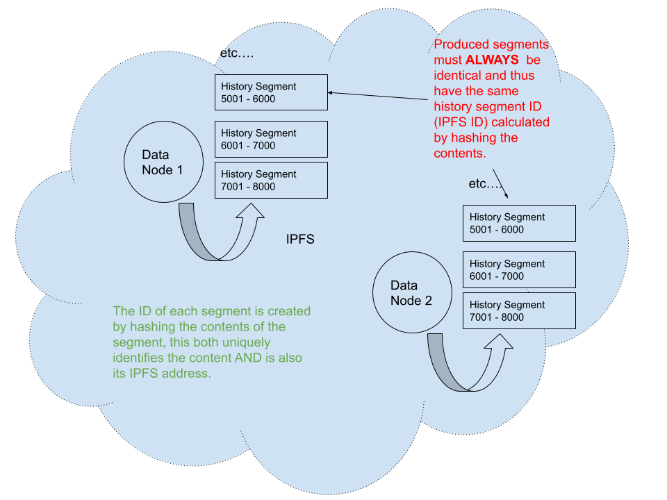
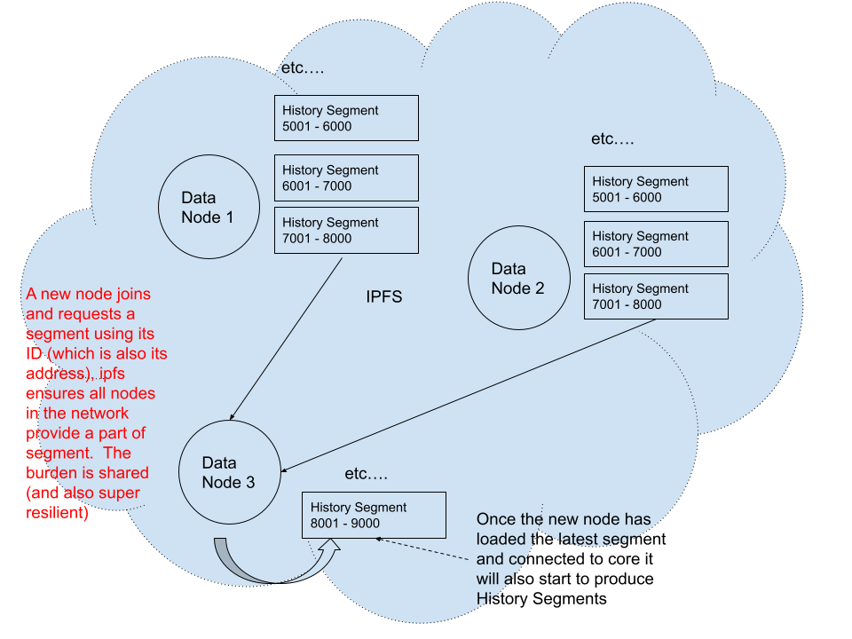

# Data node network history

[TOC]

## Why we have it

Gigabytes of event data per day are produced by the Vega core and stored in the data node.  It is not feasible for a new data node joining the network to replay all blocks from the first block in order to recreate the history and get itself into a state to be able to consume new blocks - such as ensuring it has all parties and markets - it would take far too long. Network History allows the data node to reach out to peer nodes to fetch the most recent history,  as well as older history if desired, such that it can quickly get itself up to the latest block height of the network and start to consume events for the latest block from the Vega core. As decentralisation is at the heart of the Vega protocol, this mechanism to store and retrieve network history must itself be decentralised.

## How to use it

By default, a new data node will connect to its peers, retrieve the latest segment of history, and load this into the data node such that it is in a state to consume new blocks immediately. This is controlled by the configuration parameter `AutoInitialiseFromNetworkHistory`. 

By default, the data node configuration is set up to fetch just the latest history segment, but if more history is required or preferred, that can specified when starting a data node for the first time using the `--networkhistory.initialise.block-count` flag. For example, to start your new node and have it fetch and load the last day's data, assuming a time between blocks of 1s, you would do this:

`data-node node --networkhistory.initialise.block-count=86400`

However, depending on how much history you want to load, fetching it all synchronously at startup may not be the best approach, as the network's block height will continue to increase whilst the history is being fetched. Instead, you can start the node and have it process and new blocks whilst fetching history asynchronously. How to do this is described in the next section.

If the node already contains history and `AutoInitialiseFromNetworkHistory = true` it will attempt to fetch and load all history between the data node's current block height and the network's latest block height, and load this into the node before processing new blocks.

### Getting history asynchronously

After starting the data-node, run:

`data-node network-history show`

This will display the History Segments stored in the node, e.g:

`from_height:2001 to_height:3000 chain_id:"test-chain-clbOFm" history_segment_id:"QmUggHRGorV264FxsbnQUGQpGCTdjd5xytFXUyEnQN1dy1" previous_history_segment_id:"QmaBRouyXMtprM3RyYy6Gbr4QcMmf8j5hnMu3T87wsapyY"`

Select the ID of the oldest segment (lowest `from_height`) and then run:

`data-node network-history fetch QmUggHRGorV264FxsbnQUGQpGCTdjd5xytFXUyEnQN1dy1 1000`

Replacing 1000 in the above example with however many blocks of history you would like to fetch and the segment id with the id of the oldest segment in your node.  Once this completes, stop the data-node and run:

`data-node network-history load`

That's it, your data node will now contain all the fetched history.

## How it works

So far, we've looked at why we have network history, and how to use it.  Now we delve into the details of how it works under the covers. If you plan only to use data node software and run a node, but not actively develop it, then you don't need to read this section. 

Each data node produces history segments as it processes events, and we will delve into what a History Segment is below in more detail, but in short, it's the collection of data between 2 block heights. The number of blocks in a segment is controlled by the network parameter `snapshot.interval.length` and will produce history segments at the same block height intervals as snapshots are produced by the core node.

History segments are shared between nodes using the Inter-Planetary File System (https://ipfs.tech/). Critical to the functioning of Network History is that the history segments produced on every node for a given block span are **identical** such that the IPFS content IDs of a segment for a given block span is the same across all nodes. This in turn means that there is no need to upload data between nodes, as each node will produce and therefore be able to act as a source of history segments. This ensures that when a node requests segments from the network, no one node is unfairly burdened with providing segments, and providing of the network history is not dependent on any centralised entity or singular node. Once a node has caught up with the latest network height, it in turn will create history segments and act as provider of segments to the network.  

#### IPFS Swarms and retrieving the latest history segment

All data nodes for a given network (chain) will be part of the same IPFS Swarm. The IPFS Swarm key is generated using the node's chain ID. Using a swarm key improves the quality of communication between nodes and helps ensure that there is no accidental sharing of history segments across networks. 

If configured to do so (`AutoInitialiseFromNetworkHistory = true`), a node will reach out to peers in its swarm to determine the ID and span of the latest history segment. Once the History Segment ID is retrieved, all history prior to that segment can be retrieved too, as each segment's metadata contains the previous segment's ID (as shown in the next section). 

There is also a command to get the network's latest history segment: `data-node network-history latest-history-segment-from-peers`.  

Let's now take a look at what a history segment is.

### Anatomy of a History Segment

There are 3 files contained within a History Segment, as shown above, we discuss each in turn below:

##### Metadata

In addition to the previous history segment ID, metadata also includes a schema version. The schema version is used when loading a segment to ensure that it is applied against the correct version of the data schema; the loading process will update the schema automatically as the history segments are applied. So, for example, if the node is currently on schema version 1 and you load a span of network history that includes segments from schema versions 1 and 2, the loading process will take care of loading all data in the version 1 segments to the node, before migrating the schema to version 2 and then applying the segments with schema version 2.

##### Current State Snapshot and History Snapshot

Tables in a data node are split into two types: history tables (timescale hypertables https://www.timescale.com/) and current tables. For example, positions data has both a `positions_current` and `positions` table. `positions_current` holds the latest position for each party/market pair and `positions` holds the history of position changes over time. When a data node creates a history segment, it splits this data into a current state snapshot and a history snapshot, respectively. 

The current state snapshot ensures that the data node will have the latest state verson of all the parties in the network. For example, the data node will have the up-to-date state of all parties and markets in the system, such that when an order event arrives it can process the event without violating any constraints (such as foreign keys) regardless of whether or not it holds the span of history at the point at which the party or market was created. In other words, imagine that a party is added in block 1 but the data node only has data loaded from block 10 onwards. Without the current state snapshot, the data node would not contain all the parties that have been created in the network and data constraints would be breached. 

The data in the history state snapshot contains all new entities and entity modifications that occurred in the block span for the given history segment.

It's worth emphasising here that the requirement that history segments (and therefore the contained current state and history snapshots) are identical across all nodes places some constraints on the database schema. For example `SERIAL` column types are not supported, nor are any other type that does not deterministically derive its value from the state of the data node or the underlying data. Secondarily, the current state must not be derived from the historical state using a view or such, as there is no guarantee that the required history state to correctly derive the current state will be present in the data node. It's completely  possible that the datanode may only have the latest history segment loaded.  

###### How snapshots are created

When a core node creates a snapshot, it sends an event to the data nodes that announces that it too should create a corresponding history segment. Each data node will then snapshot the data concurrently whilst continuing to process new events from the core node. This is important as we do not want to hold up the processing of events by data node under any circumstances, and history creation typically takes a relatively large time (single digit to double digit seconds as a guide). To achieve this, the snapshotting process synchronously starts a serialisable transaction. Once this is done, it then releases the event processing thread and proceeds to snapshot the data concurrently on a different thread using the transaction. This ensures the snapshotting process does not intefere with the event processing and also ensures that the snapshotting process sees a 'frozen' view of the data at the block height it is snapshotting.

