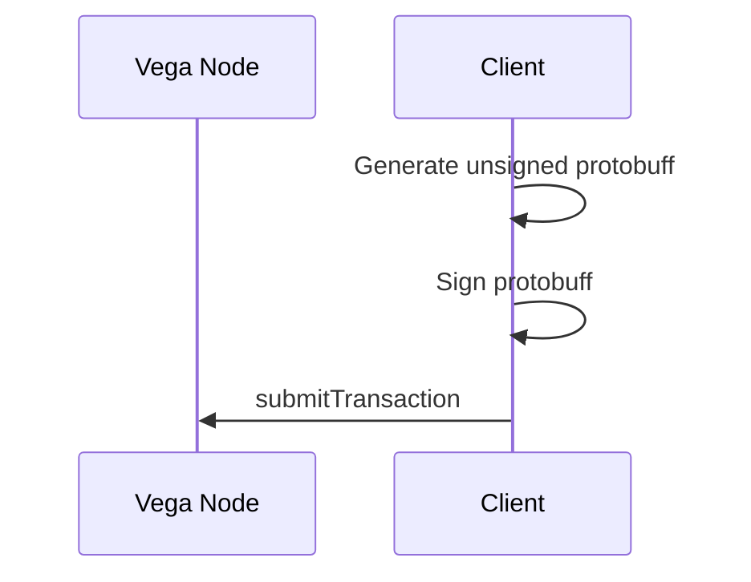
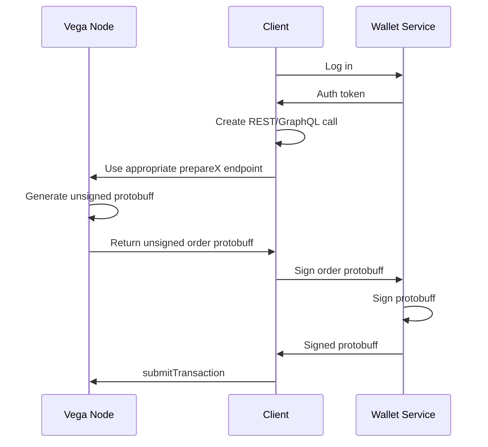
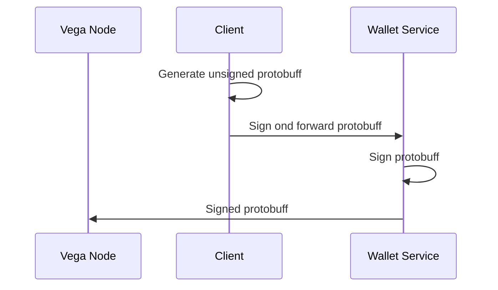

Authentication & Signing
========================

Note: this documentation does not cover the authentication provided by the soon-to-be-deprecated [auth package](../auth/). It also will allude to the [Wallet service](../wallet/README.md), which *can* be used to provide basic key management for users of your node, but is not required for signing.

## Workflow
- Vega will soon require that all transactions are signed by a keypair
- To help developers iterate quickly, the core Vega node exposes a number of endpoints that can be used to generate an unsigned protocol buffer representing a transaction
- This protocol buffer must be signed with a keypair, and then submitted to the node using the `submitTransaction` endpoint

### Wallet service
The [Wallet service](../wallet/README.md) can be run either locally or on a shared node to reduce the number of roundtrips in this transaction. See the following diagrams to understand the flow of signing an API call using the wallet service

#### Best case
In the best case, a client can generate and sign protobuffs locally:

#### Worst case
In the worst case, a client that is *not* running an auth service locally, and cannot generate its own protobuff representation for an order will need to make multiple calls between the Wallet Service and the Vega Node: 

As you can see, this leaves a lot of room for variation. A node may be able to sign, but for some reason (perhaps the language has no protobuff library) may not be able to produce its own protobuffers. In this case it can leverage the prepare endpoints in the node, but sign the call.

There is one more optimisation in this chain: the wallet service can be instructed to sign & forward to the node in the same call, skipping another round trip:

