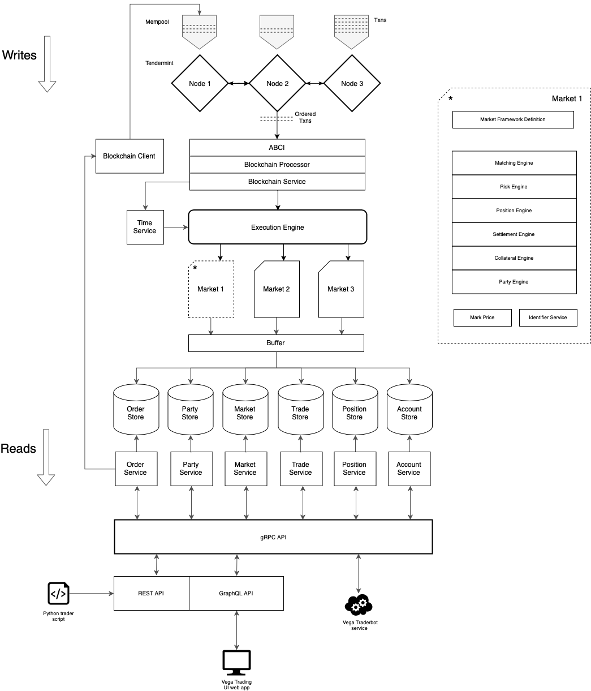

# Vega core architecture

Our core protocol implementation aims to be a reflection on the protocol design outlined in the whitepaper. It is currently written in Golang.

## Component relationships

The following diagram shows how the various components of this implementation interact with each other at a high level.

## Modelling the domain

Much of the application lives in the /internal directory. Each sub-directory is a package and these packages represent a discrete domain or concept from the whitepaper.

### Design documentation

In order to document the design, each package should have a single markdown file in the /design directory

1. Matching package (matching.md)
2. Position package (positions.md)