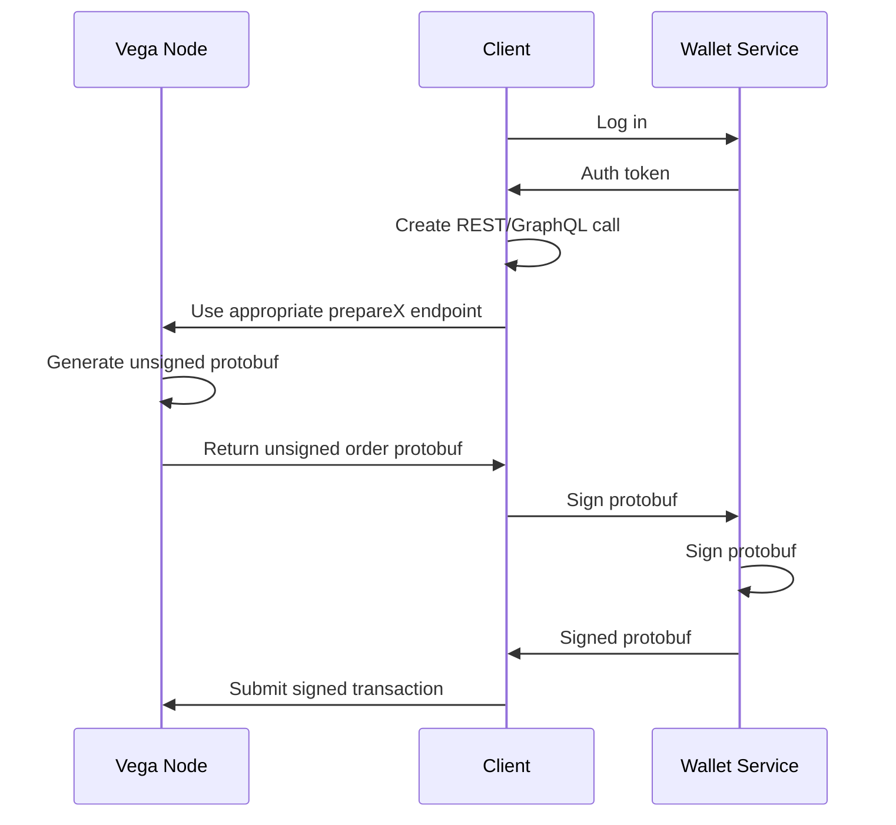
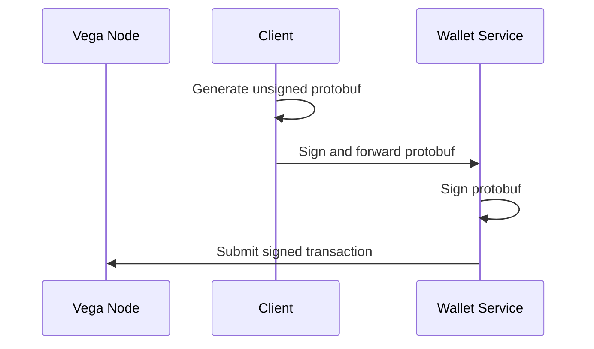
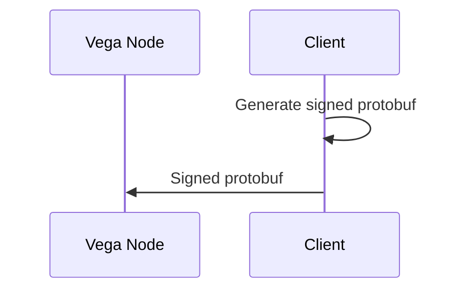

Authentication & Signing
========================

Note: this documentation does not cover the authentication provided by the soon-to-be-deprecated [`auth` package](../auth/).

## Workflow
- Vega requires that all transactions are signed by a keypair
- [vega wallet](../wallet/README.md) is a service that can be run to manage your keys
- As a convenience to client developers each Vega node exposes a number of GraphQL endpoints that can be used to generate an unsigned protocol buffer representing a transaction
- This protocol buffer must be signed with a keypair, and then submitted to the node
- This can be submitted to the node directly, using the `submitTransaction` endpoint, or in the same call as the signature by setting the [propagate](../wallet/README.md#propagate) option when signing a transactoin.

The basic interaction between services is shown below:

This is a lot of communication between services, so we have provided various shortcuts. The interactions below will all result in a valid, signed order being submitted on the user's behalf.

### Clients can generate their own protobufs
The `prepareX` endpoints (e.g.) `prepareOrder` endpoints are provided **for clients that do not have a protobuf library**. This may be true for developers hacking on bots or tools using the REST or GraphQL API who may not want to add the weight of a protobuf library to their code. If you are using a GRPC client already, or are happy to bring in a library for your platform, you can skip this step and go straight to requesting the wallet service sign your transactions:

### `vega wallet` can sign *and submit* in the same request
By providing an extra parameter to the wallet service, it can automatically submit the signed transaction to an API node on your behalf. This saves the client from having to submit it manually.

This is implemented in the [Wallet service](../wallet/README.md#propagate) as the optional 'propagate' property provided when submitting a transaction to to the `messages` endpoint. 

### Clients can sign their own transactions
The functionality provided by the wallet service can be integrated in to your Golang client. `vega` uses Ed25519 - visit the [wallet](../wallet/README.md) folder to find out more.

This is what [traderbot](https://github.com/vegaprotocol/traderbot/) does (see [traderbot #17](https://github.com/vegaprotocol/traderbot/issues/17) for details). Create `auth` and `handler` objects with `NewAuth` and `NewHandler`. Create a RSA keypair (for use with JSON web tokens) with `GenRsaKeyFiles`. Then create wallets and keypairs, and sign transactions as usual.

## Hosting wallet service for multiple users
The [Wallet service](../wallet/README.md) should be run locally, allowing you to access your keypairs for signing transactions. `vega wallet` can also be hosted centrally to manage the keys of multiple users, but this brings with it security considerations that are outside the scope of this document.

